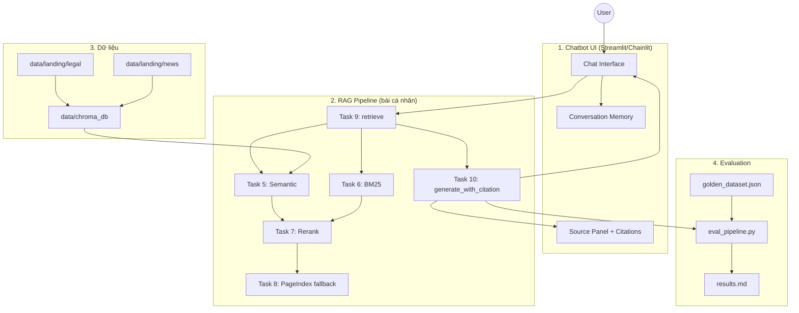

# Ngày 8 — RAG Pipeline v2

**Chương 2 | Ngày 8 trong 15**

---

## Mục Tiêu

Xây dựng một RAG pipeline thực tế, end-to-end, từ thu thập dữ liệu pháp luật và báo chí về ma tuý → xử lý → indexing → retrieval (hybrid + vectorless fallback) → generation có citation.

---

## Chủ Đề Dữ Liệu

**Pháp luật Việt Nam về ma tuý và các chất cấm** + **Các bài báo về nghệ sĩ liên quan tới ma tuý**

---

## Bắt Đầu Nhanh

```bash
# 1. Cài dependencies
pip install -r requirements.txt

# 2. Tạo .env (OPENAI_API_KEY bắt buộc; PAGEINDEX_API_KEY tuỳ chọn)
cp .env.example .env

# 3. Index dữ liệu (nếu chưa có ChromaDB)
python -m src.task4_chunking_indexing

# 4. Chạy chatbot nhóm
streamlit run group_project/app.py
```

Truy cập: **http://localhost:8501**

| Lệnh | Mô tả |
|------|-------|
| `python -m src.task3_convert_markdown` | Convert `data/landing/` → `data/standardized/` |
| `python -m src.task4_chunking_indexing` | Chunk + embed + ChromaDB |
| `pytest tests/test_individual.py -v` | Test bài cá nhân (Task 1–10) |
| `python group_project/evaluation/eval_pipeline.py` | Chạy evaluation (khi hoàn thiện) |

**Triển khai hiện tại:** Hybrid retrieval (semantic + BM25 → RRF → rerank) + PageIndex fallback, generation GPT-4o-mini có citation, Streamlit chatbot với conversation memory. Chi tiết bài nhóm xem mục [Bài Tập Nhóm](#bài-tập-nhóm) bên dưới.


---

## Cấu Trúc Thư Mục

```
Day08_RAG_pipeline_cohort2/
├── README.md
├── requirements.txt
├── .env.example
├── .gitignore
├── data/
│   ├── landing/
│   │   ├── legal/              # Task 1: PDF pháp luật
│   │   └── news/               # Task 2: JSON bài báo
│   ├── standardized/           # Task 3: markdown đã convert
│   ├── chroma_db/              # Task 4: vector store (build local)
│   └── pageindex_doc_ids.json  # Task 8: doc IDs PageIndex
├── src/
│   ├── task1_collect_legal_docs.py
│   ├── task2_crawl_news.py
│   ├── task3_convert_markdown.py
│   ├── task4_chunking_indexing.py
│   ├── task5_semantic_search.py
│   ├── task6_lexical_search.py
│   ├── task7_reranking.py
│   ├── task8_pageindex_vectorless.py
│   ├── task9_retrieval_pipeline.py
│   └── task10_generation.py
├── tests/
│   └── test_individual.py
└── group_project/
    ├── README.md               # Chi tiết bài nhóm (bản đầy đủ)
    ├── app.py                  # Streamlit chatbot
    ├── rag_service.py          # Wrapper + conversation memory
    └── evaluation/
        ├── golden_dataset.json
        ├── eval_pipeline.py
        └── results.md
```

## Nhiệm Vụ Chi Tiết

### Task 1 — Thu Thập Văn Bản Pháp Luật (Cá nhân)

Tìm và tải về **tối thiểu 3 văn bản pháp luật** dạng PDF/DOCX về ma tuý và các chất cấm. Lưu vào `data/landing/`.

**Gợi ý nguồn:**
- Luật Phòng, chống ma tuý 2021 (Luật số 73/2021/QH15)
- Nghị định 105/2021/NĐ-CP hướng dẫn thi hành Luật Phòng chống ma tuý
- Bộ luật Hình sự 2015 (sửa đổi 2017) — Chương XX: Các tội phạm về ma tuý
- Thông tư liên tịch về danh mục chất ma tuý và tiền chất

**Yêu cầu:**
- Lưu file gốc (PDF/DOCX) vào `data/landing/legal/`
- Đặt tên file rõ ràng: `luat-phong-chong-ma-tuy-2021.pdf`, `nghi-dinh-105-2021.pdf`, ...

---

### Task 2 — Crawl Bài Báo (Cá nhân)

Crawl **tối thiểu 5 bài báo** về các nghệ sĩ Việt Nam liên quan tới ma tuý.

**Thư viện khuyến nghị:** [Crawl4AI](https://github.com/unclecode/crawl4ai)

**Yêu cầu:**
- Lưu output vào `data/landing/news/`
- Mỗi bài báo lưu thành 1 file (JSON hoặc HTML)
- Ghi rõ metadata: URL gốc, ngày crawl, tiêu đề bài báo

**Code mẫu (Crawl4AI):**
```python
from crawl4ai import AsyncWebCrawler

async def crawl_article(url: str, output_dir: str):
    async with AsyncWebCrawler() as crawler:
        result = await crawler.arun(url=url)
        # Lưu result.markdown vào file
        ...
```

---

### Task 3 — Convert Sang Markdown (Cá nhân)

Sử dụng [MarkItDown](https://github.com/microsoft/markitdown) của Microsoft để convert toàn bộ file trong `data/landing/` thành Markdown.

**Cài đặt:**
```bash
pip install markitdown
```

**Code mẫu:**
```python
from markitdown import MarkItDown

md = MarkItDown()

# Convert PDF
result = md.convert("data/landing/legal/luat-phong-chong-ma-tuy-2021.pdf")
print(result.text_content)

# Convert DOCX
result = md.convert("data/landing/legal/nghi-dinh-105-2021.docx")
```

**Yêu cầu:**
- Output lưu vào `data/standardized/`
- Giữ nguyên cấu trúc thư mục con (`legal/`, `news/`)
- Mỗi file output có tên tương ứng: `luat-phong-chong-ma-tuy-2021.md`

---

### Task 4 — Chunking & Indexing (Cá nhân)

Chọn **một loại chunking strategy** và **một embedding model** để index toàn bộ markdown files vào vector store.

**Chunking — khuyến khích dùng [langchain-text-splitters](https://python.langchain.com/docs/modules/data_connection/document_transformers/):**
```bash
pip install langchain-text-splitters
```

Các loại splitter phù hợp:
- `RecursiveCharacterTextSplitter` (mặc định, an toàn)
- `MarkdownHeaderTextSplitter` (tốt cho file có heading rõ)
- `SemanticChunker` (nâng cao, dùng embedding để tách)

**Embedding model gợi ý:**
- `sentence-transformers/all-MiniLM-L6-v2` (nhẹ, nhanh)
- `BAAI/bge-m3` (multilingual, tốt cho tiếng Việt)
- OpenAI `text-embedding-3-small` (nếu có API key)

**Vector Store — khuyến cáo dùng Weaviate:**
```bash
pip install weaviate-client
```
- Weaviate hỗ trợ hybrid search (dense + BM25) built-in
- Có thể dùng Docker hoặc Weaviate Cloud
- Alternatives: ChromaDB (đơn giản), FAISS (nếu chỉ cần dense)

**Yêu cầu:**
- Ghi rõ trong code: dùng chunking nào, chunk_size bao nhiêu, overlap bao nhiêu, vì sao
- Ghi rõ embedding model nào, dimension bao nhiêu
- Index thành công toàn bộ documents

---

### Task 5 — Semantic Search Module (Cá nhân)

Viết module thực hiện **semantic search** (dense retrieval) trên vector store.

**Yêu cầu:**
```python
def semantic_search(query: str, top_k: int = 10) -> list[dict]:
    """
    Returns:
        List of {'content': str, 'score': float, 'metadata': dict}
    """
    ...
```

- Input: query string + top_k
- Output: danh sách chunks có score, sorted descending
- Phải hoạt động được với embedding model đã chọn ở Task 4

---

### Task 6 — Lexical Search Module (Cá nhân)

Viết module thực hiện **lexical search**. Mặc định sử dụng **BM25**.

```bash
pip install rank-bm25
```

**Code mẫu BM25:**
```python
from rank_bm25 import BM25Okapi

# Tokenize corpus
tokenized_corpus = [doc.split() for doc in corpus]
bm25 = BM25Okapi(tokenized_corpus)

# Search
tokenized_query = query.split()
scores = bm25.get_scores(tokenized_query)
```

**Yêu cầu:**
```python
def lexical_search(query: str, top_k: int = 10) -> list[dict]:
    """
    Returns:
        List of {'content': str, 'score': float, 'metadata': dict}
    """
    ...
```

**Bonus:** Nếu dùng phương pháp khác (TF-IDF, Elasticsearch, Weaviate BM25 built-in), hãy giải thích cơ chế hoạt động trong buổi demo → **+5 điểm bonus**.

---

### Task 7 — Reranking Module (Cá nhân)

Viết module **reranking** để chấm lại độ liên quan của kết quả retrieval.

**Lựa chọn (chọn 1):**

| Phương pháp | Thư viện / Model | Đặc điểm |
|-------------|-----------------|-----------|
| Cross-encoder reranker | `jinaai/jina-reranker-v2-base-multilingual` | Multilingual, tốt cho tiếng Việt |
| Cross-encoder reranker | `Qwen/Qwen3-Reranker-0.6B` | Nhẹ, hiệu quả |
| MMR (Maximal Marginal Relevance) | Tự implement | Giảm trùng lặp, tăng diversity |
| RRF (Reciprocal Rank Fusion) | Tự implement | Gộp kết quả từ nhiều ranker |

**Code mẫu (Jina Reranker via API):**
```python
import requests

def rerank(query: str, documents: list[str], top_k: int = 5) -> list[dict]:
    response = requests.post(
        "https://api.jina.ai/v1/rerank",
        headers={"Authorization": "Bearer YOUR_API_KEY"},
        json={
            "model": "jina-reranker-v2-base-multilingual",
            "query": query,
            "documents": documents,
            "top_n": top_k
        }
    )
    return response.json()["results"]
```

**Yêu cầu:**
```python
def rerank(query: str, candidates: list[dict], top_k: int = 5) -> list[dict]:
    """
    Re-score and re-order candidates based on relevance to query.
    """
    ...
```

---

### Task 8 — PageIndex Vectorless RAG (Cá nhân)

Đăng ký tài khoản tại [https://pageindex.ai/](https://pageindex.ai/), sau đó sử dụng [PageIndex SDK](https://github.com/VectifyAI/PageIndex) để tạo một **vectorless RAG pipeline**.

**Cài đặt:**
```bash
pip install pageindex
```

**Tham khảo:** [https://github.com/VectifyAI/PageIndex](https://github.com/VectifyAI/PageIndex)

**Yêu cầu:**
- Upload tài liệu lên PageIndex
- Viết function query PageIndex và trả về kết quả
```python
def pageindex_search(query: str, top_k: int = 5) -> list[dict]:
    """
    Vectorless retrieval using PageIndex.
    Fallback khi hybrid search không trả về kết quả phù hợp.
    """
    ...
```

---

### Task 9 — Retrieval Pipeline Hoàn Chỉnh (Cá nhân)

Kết hợp tất cả modules thành một **retrieval pipeline** thống nhất với logic fallback:

```
Query
  │
  ├─→ Semantic Search (Task 5)  ──┐
  │                                ├─→ Merge + Rerank (Task 7) → Results
  ├─→ Lexical Search (Task 6)  ──┘
  │
  └─→ Nếu hybrid search không có kết quả đủ tốt (score < threshold)
        └─→ Fallback: PageIndex Vectorless (Task 8)
```

**Yêu cầu:**
```python
def retrieve(query: str, top_k: int = 5, score_threshold: float = 0.3) -> list[dict]:
    """
    1. Chạy semantic_search + lexical_search
    2. Merge kết quả (RRF hoặc weighted fusion)
    3. Rerank
    4. Nếu top result score < threshold → fallback PageIndex
    5. Return top_k results
    """
    ...
```

---

### Task 10 — Generation Có Citation (Cá nhân)

Sắp xếp lại context chunks sau reranking để **tránh lost in the middle**, inject vào prompt, và yêu cầu LLM trả lời có **citation**.

**Document Reordering (tránh lost in the middle):**
```python
def reorder_for_llm(chunks: list[dict]) -> list[dict]:
    """
    Sắp xếp chunks theo pattern: quan trọng nhất ở đầu và cuối,
    ít quan trọng hơn ở giữa.
    Ví dụ: [1, 3, 5, 4, 2] thay vì [1, 2, 3, 4, 5]
    """
    ...
```

**Prompt template:**
```python
SYSTEM_PROMPT = """Answer the following question comprehensively.
For every statement of fact or claim, immediately insert a citation
in brackets linking to the specific source
(e.g., [Author/Platform Name, Year]).
If the information is not explicitly stated in the provided context
or knowledge base, state 'I cannot verify this information'
rather than guessing."""

def generate_with_citation(query: str, context_chunks: list[dict]) -> str:
    """
    1. Reorder chunks để tránh lost in the middle
    2. Format context với source metadata
    3. Inject vào prompt với SYSTEM_PROMPT
    4. Gọi LLM (OpenAI, Gemini, hoặc local model)
    5. Return answer có citation
    """
    ...
```

**Yêu cầu:**
- Chọn top_k và top_p phù hợp (giải thích lý do trong code comment)
- Output phải có citation dạng `[Nguồn, Năm]`
- Nếu không đủ evidence → trả về "I cannot verify this information"

---

## Bài Tập Nhóm

Sau khi hoàn thành bài cá nhân, nhóm ngồi lại để xây dựng **cả hai sản phẩm** sau (chatbot + evaluation). Chi tiết đầy đủ cũng có tại [`group_project/README.md`](group_project/README.md).

---

## Yêu cầu 1:  Sản phẩm nhóm RAG Chatbot

Xây dựng chatbot trả lời câu hỏi về pháp luật ma tuý và tin tức liên quan.

**Yêu cầu:**
- Giao diện chat (Streamlit / Gradio / Chainlit)
- Trả lời có citation (dựa trên Task 10)
- Hỗ trợ follow-up questions (conversation memory)
- Hiển thị source documents đã dùng

**Stack gợi ý:**
```
Chainlit/Streamlit → Retrieval (Task 9) → Generation (Task 10) → Display
```

### Triển khai (đã có sẵn trong repo)

| Thành phần | File | Mô tả |
|-----------|------|-------|
| Giao diện chat | `group_project/app.py` | Streamlit UI, sidebar cấu hình, câu hỏi mẫu |
| Service layer | `group_project/rag_service.py` | Ghép conversation memory + gọi Task 9/10 |
| Retrieval | `src/task9_retrieval_pipeline.py` | Hybrid semantic + BM25 → RRF → rerank |
| Generation | `src/task10_generation.py` | Reorder chunks, prompt có citation, GPT-4o-mini |

**Tính năng chatbot:**
- Trả lời tiếng Việt kèm citation `[Nguồn, Năm]`
- Hiển thị badge nguồn retrieve (Hybrid / PageIndex)
- Panel **Nguồn tham khảo** — xem từng chunk, score, loại tài liệu
- **Follow-up memory** — ghép 3 lượt hội thoại gần nhất vào query
- Cấu hình `top_k`, ngưỡng PageIndex fallback từ sidebar

**Chạy nhanh:**
```bash
pip install -r requirements.txt
python -m src.task4_chunking_indexing   # nếu chưa có ChromaDB
streamlit run group_project/app.py       # http://localhost:8501
```

Cần `OPENAI_API_KEY` trong `.env`. PageIndex fallback (tuỳ chọn) cần `PAGEINDEX_API_KEY`.

---

## Yêu cầu 2: RAG Evaluation Pipeline

Sử dụng **1 trong 3 framework** sau để evaluate pipeline RAG của nhóm:

### Framework lựa chọn

| Framework | Cài đặt | Đặc điểm |
|-----------|---------|-----------|
| [DeepEval](https://github.com/confident-ai/deepeval) | `pip install deepeval` | Nhiều metric built-in, dễ integrate với pytest |
| [RAGAS](https://github.com/explodinggradients/ragas) | `pip install ragas` | Chuẩn industry cho RAG eval, 3 trục chính |
| [TruLens](https://github.com/truera/trulens) | `pip install trulens` | Dashboard UI, feedback functions mạnh |

### Yêu cầu Evaluation

1. **Tạo Golden Dataset** — tối thiểu 15 cặp Q&A (question, expected_answer, expected_context)
2. **Chạy evaluation** trên toàn bộ golden dataset với các metrics sau:
   - **Faithfulness** — câu trả lời có bám đúng context không?
   - **Answer Relevance** — câu trả lời có đúng câu hỏi không?
   - **Context Recall** — retriever có lấy đủ evidence không?
   - **Context Precision** — trong context lấy về, bao nhiêu % thực sự hữu ích?
3. **So sánh A/B** — chạy eval trên ít nhất 2 config khác nhau (ví dụ: có reranking vs không reranking, hoặc hybrid vs dense-only)
4. **Báo cáo** — bảng điểm + phân tích worst performers + đề xuất cải tiến

### Code mẫu — DeepEval

```python
from deepeval import evaluate
from deepeval.metrics import (
    FaithfulnessMetric,
    AnswerRelevancyMetric,
    ContextualRecallMetric,
    ContextualPrecisionMetric,
)
from deepeval.test_case import LLMTestCase

# Tạo test cases từ golden dataset
test_cases = []
for item in golden_dataset:
    result = rag_pipeline.generate_with_citation(item["question"])
    test_case = LLMTestCase(
        input=item["question"],
        actual_output=result["answer"],
        expected_output=item["expected_answer"],
        retrieval_context=[c["content"] for c in result["sources"]],
    )
    test_cases.append(test_case)

# Chạy evaluation
metrics = [
    FaithfulnessMetric(threshold=0.7),
    AnswerRelevancyMetric(threshold=0.7),
    ContextualRecallMetric(threshold=0.7),
    ContextualPrecisionMetric(threshold=0.7),
]

results = evaluate(test_cases, metrics)
```

### Code mẫu — RAGAS

```python
from ragas import evaluate
from ragas.metrics import (
    faithfulness,
    answer_relevancy,
    context_recall,
    context_precision,
)
from datasets import Dataset

# Chuẩn bị data
eval_data = {
    "question": [],
    "answer": [],
    "contexts": [],
    "ground_truth": [],
}

for item in golden_dataset:
    result = rag_pipeline.generate_with_citation(item["question"])
    eval_data["question"].append(item["question"])
    eval_data["answer"].append(result["answer"])
    eval_data["contexts"].append([c["content"] for c in result["sources"]])
    eval_data["ground_truth"].append(item["expected_answer"])

dataset = Dataset.from_dict(eval_data)

# Chạy evaluation
result = evaluate(
    dataset,
    metrics=[faithfulness, answer_relevancy, context_recall, context_precision],
)
print(result.to_pandas())
```

### Code mẫu — TruLens

```python
from trulens.apps.custom import TruCustomApp, instrument
from trulens.core import Feedback
from trulens.providers.openai import OpenAI as TruOpenAI

provider = TruOpenAI()

# Define feedback functions
f_faithfulness = Feedback(provider.groundedness_measure_with_cot_reasons).on_output()
f_relevance = Feedback(provider.relevance).on_input_output()
f_context_relevance = Feedback(provider.context_relevance).on_input()

# Wrap RAG pipeline
tru_rag = TruCustomApp(
    rag_pipeline,
    app_name="DrugLaw_RAG",
    feedbacks=[f_faithfulness, f_relevance, f_context_relevance],
)

# Run evaluation
with tru_rag as recording:
    for item in golden_dataset:
        rag_pipeline.generate_with_citation(item["question"])

# View dashboard
from trulens.dashboard import run_dashboard
run_dashboard()
```

### Deliverable Evaluation

- [ ] File `group_project/evaluation/golden_dataset.json` — 15+ cặp Q&A
- [ ] File `group_project/evaluation/eval_pipeline.py` — script chạy evaluation
- [ ] File `group_project/evaluation/results.md` — bảng điểm + phân tích
- [ ] So sánh A/B ít nhất 2 configs

---

## Yêu Cầu Chung

1. **Tích hợp pipeline** từ bài cá nhân của các thành viên
2. **Demo hoạt động được** trong buổi trình bày (chạy local hoặc deploy)
3. **Evaluation pipeline** chạy được và có báo cáo kết quả
4. **Code push lên repository** chung của nhóm
5. **README** mô tả kiến trúc và phân công (điền bên dưới)

---

## Kiến Trúc Hệ Thống



---

## Phân Công Công Việc (Nhóm 4 người)

> **Nguyên tắc:** Cả nhóm hoàn thành **cả Chatbot** lẫn **Evaluation**. **TV1 + TV2 làm cặp**, cùng phát triển kiến trúc và UI song song trên cùng `app.py`.

### Tổng quan

| # | Vai trò | Phụ trách chính | Deliverable bắt buộc |
|---|---------|-----------------|----------------------|
| 1 | **Kiến trúc & Chatbot UI** | Diagram, tích hợp pipeline, giao diện chat | `group_project/app.py`, README nhóm |
| 2 | **Data & Golden Dataset** | 15+ câu hỏi eval, kiểm tra dữ liệu nhóm | `evaluation/golden_dataset.json` |
| 3 | **Evaluation & Báo cáo** | Chạy metric, A/B test, phân tích kết quả | `eval_pipeline.py`, `results.md` |

---

### Thành viên 1 + 2 — Kiến trúc & Chatbot UI

**Mục tiêu:** Xây chatbot demo end-to-end — **2 người code song song**, pair programming / chia file, merge thường xuyên.

#### Chia việc trong cặp 

| Hạng mục | Thành viên 1 | Thành viên 2 |
|----------|--------------|--------------|
| Kiến trúc | Diagram, mô tả luồng trong README | Wrapper gọi `retrieve()` + `generate_with_citation()` |
| Backend app | Module `rag_service.py`: pipeline, error handling | Config A/B (2 chế độ retrieval) |
| UI | Layout chính, input/output chat | Panel sources, citation, expander nguồn |
| UX | Conversation memory (session state) | Loading state, xử lý lỗi API key |
| DevOps | `.env.example`, `requirements.txt`, hướng dẫn chạy | Script demo: `streamlit run group_project/app.py` |

#### Deliverable chung 

- [ ] `group_project/app.py` — chatbot chạy được local
- [ ] Trả lời có citation + hiển thị `sources` / `retrieval_source`
- [ ] Follow-up questions (conversation memory)
- [ ] README nhóm: kiến trúc + hướng dẫn chạy
- [ ] Định nghĩa **Config A/B** cho TV4 chạy eval

**Gợi ý 2 config A/B (cho TV4):**
- **Config A:** Hybrid đầy đủ (semantic + BM25 + RRF + rerank + PageIndex fallback)
- **Config B:** Dense-only (chỉ semantic search, tắt rerank / lexical)

**Luồng app:**
```
User input → (optional: rewrite follow-up) → generate_with_citation()
→ hiển thị answer + expander "Nguồn tham khảo"
```

**Cách làm song song hiệu quả:**
1. TV1 tạo skeleton `app.py` + `rag_service.py`
2. TV2 làm UI components song song (không chờ xong backend)
3. Merge hàng ngày, test chung 2–3 câu hỏi mẫu
4. Tuần cuối cùng polish UI + fix bug

---

### Thành viên 3 — Golden Dataset & Kiểm tra dữ liệu

**Mục tiêu:** Bộ dữ liệu đánh giá đủ 15 câu, phủ cả pháp luật lẫn tin tức.

| Hạng mục | Chi tiết |
|----------|----------|
| Golden dataset | Mở rộng `evaluation/golden_dataset.json` lên **≥15 cặp** |
| Phân bổ chủ đề | ~10 câu pháp luật + ~5 câu tin tức nghệ sĩ/ma tuý |
| Format mỗi item | `question`, `expected_answer`, `expected_context` |
| Chất lượng | Mỗi câu có đáp án tra được từ PDF/bài báo trong `data/` |
| Hỗ trợ eval | Gắn nhãn `category`: `legal` / `news` để phân tích worst performers |
| Data nhóm | Rà soát 4 bộ pipeline cá nhân đã index đủ (ChromaDB có data) |

**Gợi ý chủ đề câu hỏi:**
- Hình phạt tội ma tuý (Điều 249–251 BLHS)
- Cai nghiện bắt buộc / tự nguyện (Luật 2021)
- Danh mục chất ma tuý
- Ca sĩ Long Nhật, Miu Lê, Sơn Ngọc Minh (tin tức)
- Ma túy trong showbiz (bài phân tích)

---

### Thành viên 4 — Evaluation Pipeline & Báo cáo

**Mục tiêu:** Chạy eval tự động, so sánh A/B, viết báo cáo có phân tích.

| Hạng mục | Chi tiết |
|----------|----------|
| Framework | Chọn **DeepEval** (đã có trong `requirements.txt`) |
| Script | Hoàn thiện `evaluation/eval_pipeline.py` |
| Metrics | Faithfulness, Answer Relevance, Context Recall, Context Precision |
| A/B test | Chạy eval trên Config A vs Config B (do TV1+TV2 định nghĩa) |
| Báo cáo | Cập nhật `evaluation/results.md`: bảng điểm, worst 3 câu, đề xuất cải tiến |
| Reproducible | `python group_project/evaluation/eval_pipeline.py` chạy end-to-end |

---

### Lịch làm việc

| Tuần | TV1 + TV2 | TV3 | TV4 |
|------|------------------|-----|-----|
| 1 | Skeleton app + diagram + prototype UI | 8 câu golden dataset | Setup DeepEval |
| 2 | Tích hợp pipeline + memory + sources panel | Đủ 15 câu + review | Chạy eval Config A |
| 3 | Polish UI + README + fix bug | Validate data | A/B + `results.md` |
| 4 | Demo rehearsal (cả nhóm) | Demo rehearsal | Demo rehearsal |

---

### Checklist nộp bài 

- [ ] Chatbot chạy local (`streamlit run ...`)
- [ ] Trả lời có citation + hiển thị sources
- [ ] Follow-up questions hoạt động
- [ ] `golden_dataset.json` ≥ 15 câu
- [ ] `eval_pipeline.py` chạy 4 metrics
- [ ] So sánh A/B ≥ 2 configs trong `results.md`
- [ ] README nhóm có kiến trúc + phân công (bảng dưới)
- [ ] Code push lên repo chung

---

### Bảng phân công (điền MSSV)

| Thành viên | MSSV | Nhiệm vụ | Trạng thái |
|-----------|------|----------|------------|
| Thành viên 1 | | Kiến trúc & UI: backend, diagram, README, config A/B | ⬜ Chưa bắt đầu |
| Thành viên 2 | | Kiến trúc & UI: chat UI, memory, citation, sources panel | ⬜ Chưa bắt đầu |
| Thành viên 3 | | Golden dataset ≥15 Q&A, kiểm tra dữ liệu nhóm | ⬜ Chưa bắt đầu |
| Thành viên 4 | | Evaluation: DeepEval, A/B test, `results.md` | ⬜ Chưa bắt đầu |

---

## Hướng Dẫn Chạy

### Bài cá nhân (Task 1–10)

```bash
pip install -r requirements.txt
cp .env.example .env   # điền API keys

# Pipeline dữ liệu
python -m src.task3_convert_markdown      # Task 3
python -m src.task4_chunking_indexing     # Task 4

# Kiểm tra từng module
python -m src.task5_semantic_search
python -m src.task9_retrieval_pipeline
python -m src.task10_generation

# Automated tests
pytest tests/test_individual.py -v
```

### Bài nhóm — RAG Chatbot

```bash
streamlit run group_project/app.py
```

Cần `OPENAI_API_KEY` trong `.env`. PageIndex fallback (tuỳ chọn) cần `PAGEINDEX_API_KEY`.

### Bài nhóm — Evaluation

```bash
pip install deepeval   # hoặc ragas / trulens
python group_project/evaluation/eval_pipeline.py
```

Kết quả ghi vào `group_project/evaluation/results.md`.

### Thêm data từ nhánh thành viên khác

1. Copy file vào `data/landing/legal/` hoặc `data/landing/news/`
2. Chạy lại Task 3 → Task 4 (ChromaDB được build lại từ đầu)
3. (Tuỳ chọn) Upload PDF mới: `python -m src.task8_pageindex_vectorless`

### Biến môi trường (`.env`)

| Biến | Task | Bắt buộc |
|------|------|----------|
| `OPENAI_API_KEY` | Task 10, chatbot | Có |
| `PAGEINDEX_API_KEY` | Task 8 fallback | Tuỳ chọn |
| `JINA_API_KEY` | Task 7 rerank (API) | Tuỳ chọn |

```bash
cp .env.example .env   # tạo từ template — không commit file .env
```

---

## Chấm Điểm

### Tổng Quan Phân Bổ Điểm

| Thành phần | Tỷ trọng | Mô tả |
|-----------|----------|-------|
| **Bài Cá Nhân** | **50%** | 10 tasks, chấm bằng automated tests + manual review |
| **Bài Nhóm** | **30%** | RAG Chatbot + Evaluation pipeline |
| **Bonus** | **20%** | Các tiêu chí nâng cao (xem bên dưới) |

---

### Bài Cá Nhân — 50 điểm (50%)

Chấm bằng automated test suite (`pytest tests/ -v`). Mỗi task có test riêng.

| Task | Nội dung | Điểm | Test |
|------|----------|------|------|
| 1 | Thu thập văn bản pháp luật (≥3 files tồn tại trong `data/landing/legal/`) | 3 | `test_task1_*` |
| 2 | Crawl bài báo (≥5 files tồn tại trong `data/landing/news/`) | 3 | `test_task2_*` |
| 3 | Convert markdown (files tồn tại trong `data/standardized/`) | 4 | `test_task3_*` |
| 4 | Chunking + Indexing (vector store có data) | 7 | `test_task4_*` |
| 5 | Semantic search trả về kết quả đúng format, sorted | 6 | `test_task5_*` |
| 6 | Lexical search (BM25) trả về kết quả đúng format | 6 | `test_task6_*` |
| 7 | Reranking hoạt động, output re-sorted | 6 | `test_task7_*` |
| 8 | PageIndex query trả về kết quả | 4 | `test_task8_*` |
| 9 | Retrieval pipeline + fallback logic hoạt động | 7 | `test_task9_*` |
| 10 | Generation có citation + reorder | 4 | `test_task10_*` |
| **Tổng** | | **50** | |

---

### Bài Nhóm — 30 điểm (30%)

| Tiêu chí | Điểm |
|----------|------|
| RAG Chatbot demo hoạt động được | 8 |
| Tích hợp pipeline các thành viên | 4 |
| Kiến trúc rõ ràng + README | 3 |
| Chất lượng câu trả lời (có citation, đúng nội dung) | 3 |
| **Evaluation pipeline** (DeepEval / RAGAS / TruLens) | **12** |
| — Golden dataset ≥15 Q&A pairs | 3 |
| — Chạy eval với ≥4 metrics | 4 |
| — So sánh A/B ≥2 configs + phân tích | 3 |
| — Báo cáo kết quả có phân tích worst performers | 2 |

---

### Bonus — 20 điểm (20%)

Demo hoặc đặt câu hỏi mà nhóm đang demo khiến LLM không trả lời được (mỗi câu 5 điểm)

---

### Chạy Test Chấm Điểm Bài Cá Nhân

```bash
# Chạy toàn bộ test suite
pytest tests/ -v

# Chạy từng task
pytest tests/test_individual.py::TestTask1 -v
pytest tests/test_individual.py::TestTask5 -v
```

---

## Hướng Dẫn Thời Gian

| Giai đoạn | Thời gian | Hoạt động |
|-----------|-----------|-----------|
| Task 1–3 | 0:00–0:45 | Thu thập data + convert markdown |
| Task 4–6 | 0:45–1:45 | Chunking, indexing, search modules |
| Task 7–8 | 1:45–2:15 | Reranking + PageIndex setup |
| Task 9–10 | 2:15–3:00 | Pipeline hoàn chỉnh + generation |
| Bài nhóm | Ngoài giờ | Tích hợp + build demo |

---

## Tài Liệu Tham Khảo

- [Crawl4AI](https://github.com/unclecode/crawl4ai) — Web crawling library
- [MarkItDown](https://github.com/microsoft/markitdown) — Microsoft document converter
- [LangChain Text Splitters](https://python.langchain.com/docs/modules/data_connection/document_transformers/) — Chunking strategies
- [Weaviate](https://weaviate.io/developers/weaviate) — Vector database with hybrid search
- [rank-bm25](https://github.com/dorianbrown/rank_bm25) — BM25 implementation
- [PageIndex](https://github.com/VectifyAI/PageIndex) — Vectorless RAG
- [Jina Reranker](https://jina.ai/reranker/) — Cross-encoder reranking API
- Liu et al. (2023), *Lost in the Middle: How Language Models Use Long Contexts*

---

## Lưu ý

Hãy giữ lại repo này nếu bạn học track 3 giai đoạn 2 — dự án sẽ được phát triển tiếp lên **knowledge graph** để xử lý các câu hỏi phức tạp hơn.
