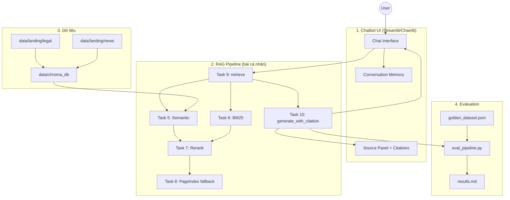

# Bài Tập Nhóm — Search Engine / RAG Chatbot

## Mục Tiêu

Sau khi hoàn thành bài cá nhân, nhóm ngồi lại để xây dựng **1 trong 2 sản phẩm**:

---

## Yêu cầu 1:  Sản phẩm nhóm RAG Chatbot

Xây dựng chatbot trả lời câu hỏi về pháp luật ma tuý và tin tức liên quan.

**Yêu cầu:**
- Giao diện chat (Streamlit / Gradio / Chainlit)
- Trả lời có citation (dựa trên Task 10)
- Hỗ trợ follow-up questions (conversation memory)
- Hiển thị source documents đã dùng

**Stack gợi ý:**
```
Chainlit/Streamlit → Retrieval (Task 9) → Generation (Task 10) → Display
```

### Triển khai (đã có sẵn trong repo)

| Thành phần | File | Mô tả |
|-----------|------|-------|
| Giao diện chat | `group_project/app.py` | Streamlit UI, sidebar cấu hình, câu hỏi mẫu |
| Service layer | `group_project/rag_service.py` | Ghép conversation memory + gọi Task 9/10 |
| Retrieval | `src/task9_retrieval_pipeline.py` | Hybrid semantic + BM25 → RRF → rerank |
| Generation | `src/task10_generation.py` | Reorder chunks, prompt có citation, GPT-4o-mini |

**Tính năng chatbot:**
- Trả lời tiếng Việt kèm citation `[Nguồn, Năm]`
- Hiển thị badge nguồn retrieve (Hybrid / PageIndex)
- Panel **Nguồn tham khảo** — xem từng chunk, score, loại tài liệu
- **Follow-up memory** — ghép 3 lượt hội thoại gần nhất vào query
- Cấu hình `top_k`, ngưỡng PageIndex fallback từ sidebar

**Chạy nhanh:**
```bash
pip install -r requirements.txt
python -m src.task4_chunking_indexing   # nếu chưa có ChromaDB
streamlit run group_project/app.py       # http://localhost:8501
```

Cần `OPENAI_API_KEY` trong `.env`. PageIndex fallback (tuỳ chọn) cần `PAGEINDEX_API_KEY`.

---

## Yêu cầu 2: RAG Evaluation Pipeline

Sử dụng **1 trong 3 framework** sau để evaluate pipeline RAG của nhóm:

### Framework lựa chọn

| Framework | Cài đặt | Đặc điểm |
|-----------|---------|-----------|
| [DeepEval](https://github.com/confident-ai/deepeval) | `pip install deepeval` | Nhiều metric built-in, dễ integrate với pytest |
| [RAGAS](https://github.com/explodinggradients/ragas) | `pip install ragas` | Chuẩn industry cho RAG eval, 3 trục chính |
| [TruLens](https://github.com/truera/trulens) | `pip install trulens` | Dashboard UI, feedback functions mạnh |

### Yêu cầu Evaluation

1. **Tạo Golden Dataset** — tối thiểu 15 cặp Q&A (question, expected_answer, expected_context)
2. **Chạy evaluation** trên toàn bộ golden dataset với các metrics sau:
   - **Faithfulness** — câu trả lời có bám đúng context không?
   - **Answer Relevance** — câu trả lời có đúng câu hỏi không?
   - **Context Recall** — retriever có lấy đủ evidence không?
   - **Context Precision** — trong context lấy về, bao nhiêu % thực sự hữu ích?
3. **So sánh A/B** — chạy eval trên ít nhất 2 config khác nhau (ví dụ: có reranking vs không reranking, hoặc hybrid vs dense-only)
4. **Báo cáo** — bảng điểm + phân tích worst performers + đề xuất cải tiến

### Code mẫu — DeepEval

```python
from deepeval import evaluate
from deepeval.metrics import (
    FaithfulnessMetric,
    AnswerRelevancyMetric,
    ContextualRecallMetric,
    ContextualPrecisionMetric,
)
from deepeval.test_case import LLMTestCase

# Tạo test cases từ golden dataset
test_cases = []
for item in golden_dataset:
    result = rag_pipeline.generate_with_citation(item["question"])
    test_case = LLMTestCase(
        input=item["question"],
        actual_output=result["answer"],
        expected_output=item["expected_answer"],
        retrieval_context=[c["content"] for c in result["sources"]],
    )
    test_cases.append(test_case)

# Chạy evaluation
metrics = [
    FaithfulnessMetric(threshold=0.7),
    AnswerRelevancyMetric(threshold=0.7),
    ContextualRecallMetric(threshold=0.7),
    ContextualPrecisionMetric(threshold=0.7),
]

results = evaluate(test_cases, metrics)
```

### Code mẫu — RAGAS

```python
from ragas import evaluate
from ragas.metrics import (
    faithfulness,
    answer_relevancy,
    context_recall,
    context_precision,
)
from datasets import Dataset

# Chuẩn bị data
eval_data = {
    "question": [],
    "answer": [],
    "contexts": [],
    "ground_truth": [],
}

for item in golden_dataset:
    result = rag_pipeline.generate_with_citation(item["question"])
    eval_data["question"].append(item["question"])
    eval_data["answer"].append(result["answer"])
    eval_data["contexts"].append([c["content"] for c in result["sources"]])
    eval_data["ground_truth"].append(item["expected_answer"])

dataset = Dataset.from_dict(eval_data)

# Chạy evaluation
result = evaluate(
    dataset,
    metrics=[faithfulness, answer_relevancy, context_recall, context_precision],
)
print(result.to_pandas())
```

### Code mẫu — TruLens

```python
from trulens.apps.custom import TruCustomApp, instrument
from trulens.core import Feedback
from trulens.providers.openai import OpenAI as TruOpenAI

provider = TruOpenAI()

# Define feedback functions
f_faithfulness = Feedback(provider.groundedness_measure_with_cot_reasons).on_output()
f_relevance = Feedback(provider.relevance).on_input_output()
f_context_relevance = Feedback(provider.context_relevance).on_input()

# Wrap RAG pipeline
tru_rag = TruCustomApp(
    rag_pipeline,
    app_name="DrugLaw_RAG",
    feedbacks=[f_faithfulness, f_relevance, f_context_relevance],
)

# Run evaluation
with tru_rag as recording:
    for item in golden_dataset:
        rag_pipeline.generate_with_citation(item["question"])

# View dashboard
from trulens.dashboard import run_dashboard
run_dashboard()
```

### Deliverable Evaluation

- [ ] File `group_project/evaluation/golden_dataset.json` — 15+ cặp Q&A
- [ ] File `group_project/evaluation/eval_pipeline.py` — script chạy evaluation
- [ ] File `group_project/evaluation/results.md` — bảng điểm + phân tích
- [ ] So sánh A/B ít nhất 2 configs

---

## Yêu Cầu Chung

1. **Tích hợp pipeline** từ bài cá nhân của các thành viên
2. **Demo hoạt động được** trong buổi trình bày (chạy local hoặc deploy)
3. **Evaluation pipeline** chạy được và có báo cáo kết quả
4. **Code push lên repository** chung của nhóm
5. **README** mô tả kiến trúc và phân công (điền bên dưới)

---

## Kiến Trúc Hệ Thống



---

## Phân Công Công Việc (Nhóm 4 người)

> **Nguyên tắc:** Cả nhóm hoàn thành **cả Chatbot** lẫn **Evaluation**. **TV1 + TV2 làm cặp**, cùng phát triển kiến trúc và UI song song trên cùng `app.py`.

### Tổng quan

| # | Vai trò | Phụ trách chính | Deliverable bắt buộc |
|---|---------|-----------------|----------------------|
| 1 | **Kiến trúc & Chatbot UI** | Diagram, tích hợp pipeline, giao diện chat | `group_project/app.py`, README nhóm |
| 2 | **Data & Golden Dataset** | 15+ câu hỏi eval, kiểm tra dữ liệu nhóm | `evaluation/golden_dataset.json` |
| 3 | **Evaluation & Báo cáo** | Chạy metric, A/B test, phân tích kết quả | `eval_pipeline.py`, `results.md` |

---

### Thành viên 1 + 2 — Kiến trúc & Chatbot UI

**Mục tiêu:** Xây chatbot demo end-to-end — **2 người code song song**, pair programming / chia file, merge thường xuyên.

#### Chia việc trong cặp 

| Hạng mục | Thành viên 1 | Thành viên 2 |
|----------|--------------|--------------|
| Kiến trúc | Diagram, mô tả luồng trong README | Wrapper gọi `retrieve()` + `generate_with_citation()` |
| Backend app | Module `rag_service.py`: pipeline, error handling | Config A/B (2 chế độ retrieval) |
| UI | Layout chính, input/output chat | Panel sources, citation, expander nguồn |
| UX | Conversation memory (session state) | Loading state, xử lý lỗi API key |
| DevOps | `.env.example`, `requirements.txt`, hướng dẫn chạy | Script demo: `streamlit run group_project/app.py` |

#### Deliverable chung 

- [ ] `group_project/app.py` — chatbot chạy được local
- [ ] Trả lời có citation + hiển thị `sources` / `retrieval_source`
- [ ] Follow-up questions (conversation memory)
- [ ] README nhóm: kiến trúc + hướng dẫn chạy
- [ ] Định nghĩa **Config A/B** cho TV4 chạy eval

**Gợi ý 2 config A/B (cho TV4):**
- **Config A:** Hybrid đầy đủ (semantic + BM25 + RRF + rerank + PageIndex fallback)
- **Config B:** Dense-only (chỉ semantic search, tắt rerank / lexical)

**Luồng app:**
```
User input → (optional: rewrite follow-up) → generate_with_citation()
→ hiển thị answer + expander "Nguồn tham khảo"
```

**Cách làm song song hiệu quả:**
1. TV1 tạo skeleton `app.py` + `rag_service.py`
2. TV2 làm UI components song song (không chờ xong backend)
3. Merge hàng ngày, test chung 2–3 câu hỏi mẫu
4. Tuần cuối cùng polish UI + fix bug

---

### Thành viên 3 — Golden Dataset & Kiểm tra dữ liệu

**Mục tiêu:** Bộ dữ liệu đánh giá đủ 15 câu, phủ cả pháp luật lẫn tin tức.

| Hạng mục | Chi tiết |
|----------|----------|
| Golden dataset | Mở rộng `evaluation/golden_dataset.json` lên **≥15 cặp** |
| Phân bổ chủ đề | ~10 câu pháp luật + ~5 câu tin tức nghệ sĩ/ma tuý |
| Format mỗi item | `question`, `expected_answer`, `expected_context` |
| Chất lượng | Mỗi câu có đáp án tra được từ PDF/bài báo trong `data/` |
| Hỗ trợ eval | Gắn nhãn `category`: `legal` / `news` để phân tích worst performers |
| Data nhóm | Rà soát 4 bộ pipeline cá nhân đã index đủ (ChromaDB có data) |

**Gợi ý chủ đề câu hỏi:**
- Hình phạt tội ma tuý (Điều 249–251 BLHS)
- Cai nghiện bắt buộc / tự nguyện (Luật 2021)
- Danh mục chất ma tuý
- Ca sĩ Long Nhật, Miu Lê, Sơn Ngọc Minh (tin tức)
- Ma túy trong showbiz (bài phân tích)

---

### Thành viên 4 — Evaluation Pipeline & Báo cáo

**Mục tiêu:** Chạy eval tự động, so sánh A/B, viết báo cáo có phân tích.

| Hạng mục | Chi tiết |
|----------|----------|
| Framework | Chọn **DeepEval** (đã có trong `requirements.txt`) |
| Script | Hoàn thiện `evaluation/eval_pipeline.py` |
| Metrics | Faithfulness, Answer Relevance, Context Recall, Context Precision |
| A/B test | Chạy eval trên Config A vs Config B (do TV1+TV2 định nghĩa) |
| Báo cáo | Cập nhật `evaluation/results.md`: bảng điểm, worst 3 câu, đề xuất cải tiến |
| Reproducible | `python group_project/evaluation/eval_pipeline.py` chạy end-to-end |

---

### Lịch làm việc

| Tuần | TV1 + TV2 | TV3 | TV4 |
|------|------------------|-----|-----|
| 1 | Skeleton app + diagram + prototype UI | 8 câu golden dataset | Setup DeepEval |
| 2 | Tích hợp pipeline + memory + sources panel | Đủ 15 câu + review | Chạy eval Config A |
| 3 | Polish UI + README + fix bug | Validate data | A/B + `results.md` |
| 4 | Demo rehearsal (cả nhóm) | Demo rehearsal | Demo rehearsal |

---

### Checklist nộp bài 

- [ ] Chatbot chạy local (`streamlit run ...`)
- [ ] Trả lời có citation + hiển thị sources
- [ ] Follow-up questions hoạt động
- [ ] `golden_dataset.json` ≥ 15 câu
- [ ] `eval_pipeline.py` chạy 4 metrics
- [ ] So sánh A/B ≥ 2 configs trong `results.md`
- [ ] README nhóm có kiến trúc + phân công (bảng dưới)
- [ ] Code push lên repo chung

---

## Phân Công Công Việc

| Thành viên | MSSV | Nhiệm vụ | Trạng thái |
|-----------|------|----------|------------|
| Thành viên 1 | | Kiến trúc & UI: backend, diagram, README, config A/B | ⬜ Chưa bắt đầu |
| Thành viên 2 | | Kiến trúc & UI: chat UI, memory, citation, sources panel | ⬜ Chưa bắt đầu |
| Thành viên 3 | | Golden dataset ≥15 Q&A, kiểm tra dữ liệu nhóm | ⬜ Chưa bắt đầu |
| Thành viên 4 | | Evaluation: DeepEval, A/B test, `results.md` | ⬜ Chưa bắt đầu |

---

## Hướng Dẫn Chạy

```bash
# Cài đặt dependencies (từ thư mục gốc project)
pip install -r requirements.txt

# Đảm bảo đã index dữ liệu (nếu chưa có ChromaDB)
python -m src.task4_chunking_indexing

# Cấu hình API key trong .env
# OPENAI_API_KEY=sk-...

# Chạy chatbot
streamlit run group_project/app.py
```

Truy cập: **http://localhost:8501**

---

## Lưu ý: Hãy giữ lại repo này nếu như bạn học track 3 giai đoạn 2, chúng ta sẽ phát triển tiếp dự án lên knowledge graph để khắc phục các câu hỏi hóc búa khi có các câu hỏi khó.
